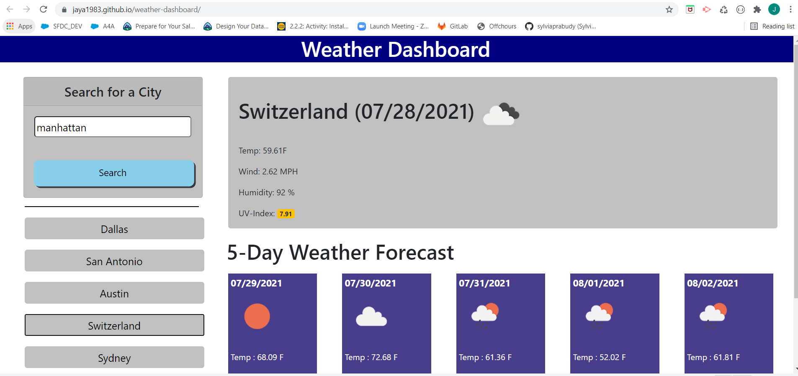

# ** weather-dashboard **
A Web page where user can search a particular city's weather by its name.
The top left corner displays a card layout, where an input text box with a search button is provided.
Once the user clicks on search OR press ENTER,  a recent search history , a Today's Weather section &  daily forecast for next 5 days will appear below the search button.

# ***Recent-Search-History***
- last 10 recently searched city names are displayed just below the search button.
- The section can be used to click on any recntly searched city and accordingly the today's weather and 5 day forecast sections are updated    with newly searched city's weather.

And the right side of the page will display today's weather section:
# ***Today's-Weather-section***
- A header with City name, date and an icon to depict weather condition.
- Temp, Wind Speed, Humidity and UV-Index 
- UV-Index will display a color that indicates whether the conditions are favorable, moderate, or severe

Below today's weather, there is a 5 day Weather forecast section that displays weather conditions for the next 5  days.
# ***5-Day-Weather-forecast***
- This section also displays Temp, Humidity, Wind Speed and an icon to depict weather condition.

# Code-Logic
Todays Weather section uses WEATHER API to search with parameters as city name, API key and units .
A different API is called to get UV-Index with Latitude and Longitude as parameters for that city
The Weather API for 5-day weather forecast returns a list of weather conditions at different times for next 5 days.
- ***5 Day Weather Forecast ***
 - Each day has 8 objects with different timings.
 - For this project, onnly 3.00 pm timings are chosen. This is 4th occurence of the list array.
 - A new index (calculatedIndex) is calculated to get the 4th occurence for each day.
 - And then Temp, Wind speed and Humidity are displayed. 

# Screen Shot

